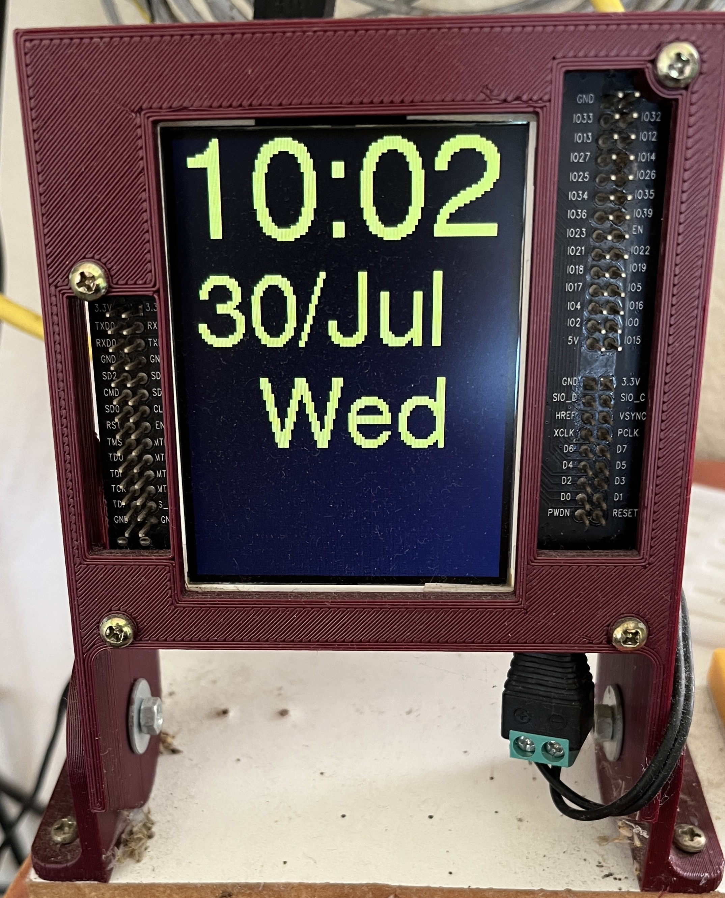

# ESP_WROVER_KIT_Table_Clock
Create a table clock with ESP_WROVER_KIT

## Creating a *credentials.h* file
You need to create a credential file with the WiFi parameters:
Create de *credentials.h* inside de src folder:
```
// Replace with your network credentials
const char* ssid     = "YOUR_WIFI_SSID";
const char* wifipw   = "YOUR_WIFI_PASSWORD";
```

## This is how the clock looks like

